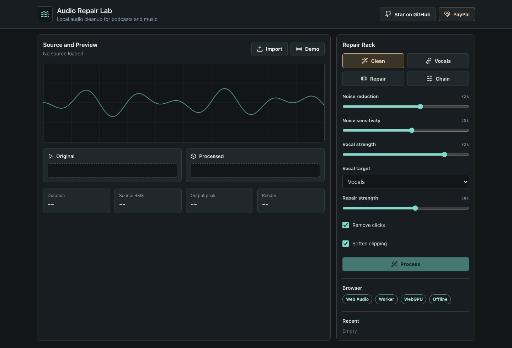
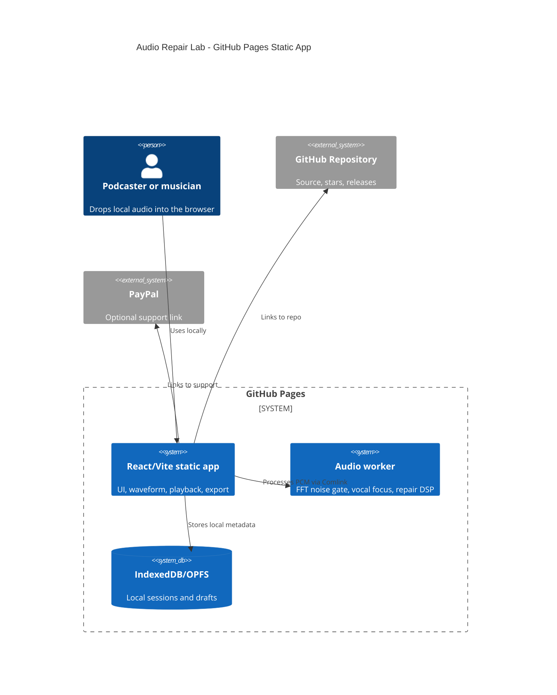

# Audio Repair Lab

[](https://baditaflorin.github.io/audio-repair-lab/)
[](./LICENSE)

Audio Repair Lab is a browser-based audio cleanup workbench for podcasters and
musicians who want noise removal, vocal focus, and quick repair without sending
their files to a server.

Live site: https://baditaflorin.github.io/audio-repair-lab/

Repository: https://github.com/baditaflorin/audio-repair-lab

Support development: https://www.paypal.com/paypalme/florinbadita



## Quickstart

```sh
npm install
make install-hooks
make dev
```

## Build

```sh
make test
make build
make pages-preview
```

The production build is committed to `docs/` because GitHub Pages serves the
site from `main` branch `/docs`.

## What It Does

- Imports browser-decodable audio, including WAV and MP3 where supported.
- Processes audio locally with Web Audio, Web Workers, and FFT-based DSP.
- Exports a processed WAV file without uploading source audio.
- Shows the running version and source commit in the page footer.

## Architecture



More detail: `docs/architecture.md`

ADRs: `docs/adr/`

Deployment guide: `docs/deploy.md`
