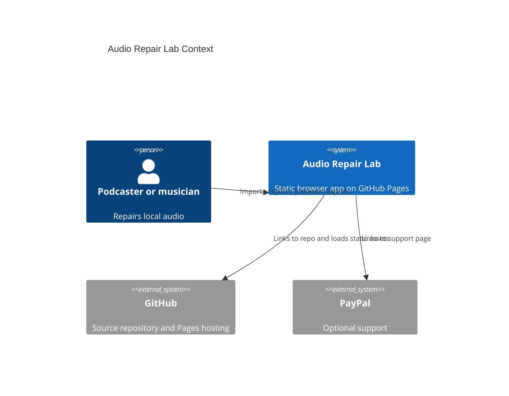
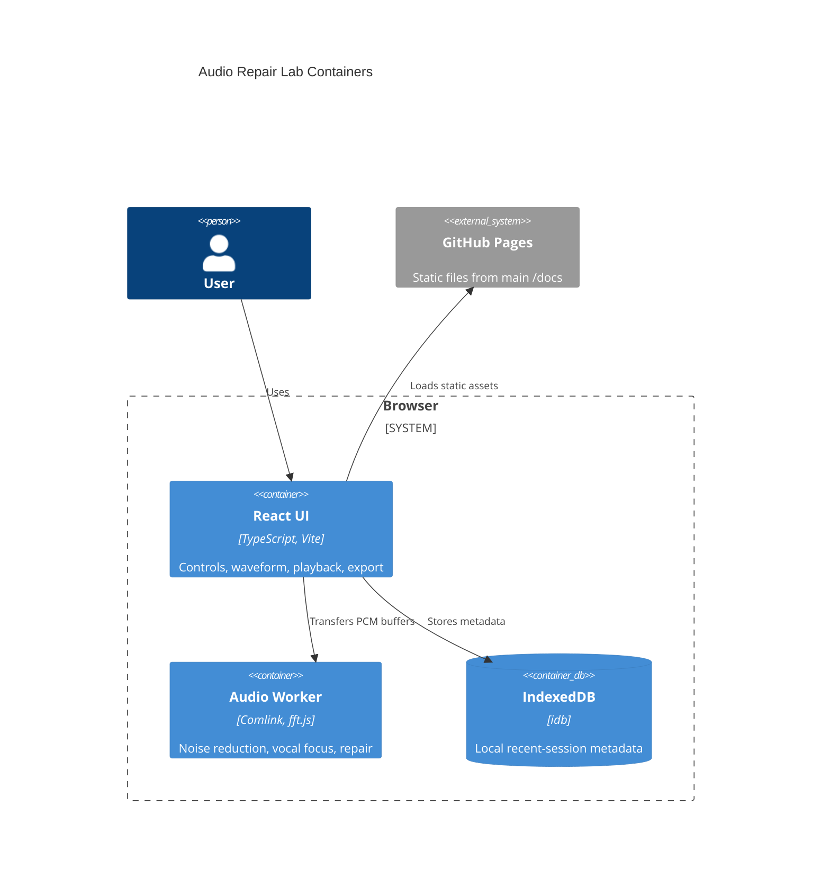

# Architecture

Audio Repair Lab is a Mode A static app served by GitHub Pages. The runtime is
the browser: Web Audio decodes and plays media, a Web Worker performs heavy DSP,
and IndexedDB stores local metadata.

## Context

## Containers

## Module Boundaries

- `src/features/audio/` owns decoding state, processing calls, export, and tests.
- `src/features/audio/workers/` owns CPU-intensive DSP and avoids DOM APIs.
- `src/components/` owns reusable presentational controls.
- `scripts/` owns local build, smoke, and Pages helper automation.
